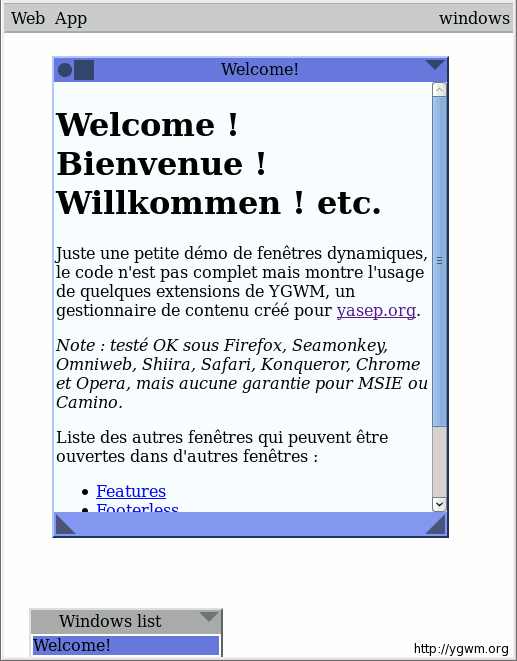

YGWM: YG's JavaScript window manager and toolkit

Created 2013-08-06 by Yann Guidon
Version 2021-01-22

Welcome to the YGWM project's github !

YGWM is "Whygee's Window Manager", a lightweight client-side JavaScript toolkit and modular environment that turns your website into an application (or vice versa).

video demo of the window manager's features in action.

It was created in 2009 for the "http://yasep.org/" YASEP project's website.

Here you will find the source code, API, examples and tutorials so you can use it in your own projects.

YGWM offers more than fancy minimalistic windows. It provides services such as themes, uniform drag-and-drop or data entry, minimisation and compaction of the whole site, internationalisation (language picker), file save and load, cookie management, an unbounded virtual desktop, a system of "keys" to call windows from anywhere, custom hyperlinks and quite a few other gadgets... It's like a browser in your browser yet it remains space-conscious, making it load and run fast!

YGWM is Free Softwware ! It is available under the GNU Affero GPLv3 license.

Basicaly, you may use it as long as the whole website's source code is available for download.

YGWM ranked 2nd ex-aequo at the Open World Forum Code Contest in Paris in september 2011.

Still under construction :-)

In this repository :

href="ygwm">ygwm</a> contains the source code</i>
href="doc">doc</a> contains the documentation and explains the source code

doc/01_utils.js.html">doc/01_utils.js.html</a> : basic functions used throughout the code
doc/02_lang.js-i8n.js.html">doc/02_lang.js-i8n.js.html</a> : multi-language support
doc/03_application.js.html">doc/03_application.js.html</a> : some site customisation
doc/04_init.js.html">doc/04_init.js.html</a> : organises the site's modules and initialisation
ygwm.tgz">ygwm.tgz</a> contains the whole site so you can use the files on your own computer.

Funny trivia, courtesy of Jeff from Wales :

Actually Gwm is the dative form of Cwm, which means the Valley.
"Y cwm" would be "the valley" 
"o gwm" would be "to the valley". 
Most welsh speakers would probably understand y-gwm as y-cwm.